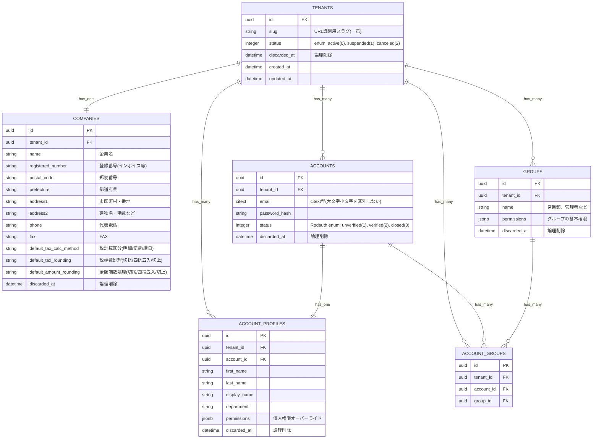

# フェーズ1: システム基盤構築 DB設計

本ドキュメントは `docs/requirements/01_foundation.md` に基づいた、フェーズ1（マルチテナント・認証・権限管理基盤）のデータベーススキーマ設計である。

## ER図

## テーブル定義詳細

### 1. 共通仕様
- **プライマリキー (PK)**: 予測不可能性と時系列ソートの両立のため、全てのテーブルのPKに **UUIDv7** を採用する。
- **マルチテナント**: `tenants` 以外の全てのテーブルは `tenant_id` を持ち、複合ユニークインデックス（例: `[tenant_id, email]`）などで厳密にテナントを分離する。
- **論理削除 (Soft Delete)**: トランザクション・マスタに関わる主要テーブルには `discarded_at` (timestamp) を追加し、物理削除を回避する。
- **監査ログ (Audit Log)**: 変更履歴管理用テーブル（PaperTrailの `versions` など）を別途構築し、データ変更の履歴を管理する（図からは省略）。

### 2. テーブル一覧

#### `tenants`
システム管理用の論理枠。
- `slug`: テナント固有のURL（サブドメイン等）を特定するための一意の文字列（例: `my-company`）。
- `status` (integer): 契約状態を `enum` で管理（`active: 0`, `suspended: 1`, `canceled: 2`）
- `discarded_at`: テナント単位の論理削除（サービス解約時など）

#### `companies`
テナントに紐づく実際の企業情報（自社情報）。各種帳票（請求書など）の印字に使用される。
- `tenant_id`: FK, Unique
- `name`: 企業名
- `registered_number`: 適格請求書発行事業者登録番号
- `postal_code`: 郵便番号
- `prefecture`, `address1`, `address2`: 住所（都道府県、市区町村番地、建物名）
- `phone`, `fax`: 電話番号、FAX番号
- `default_tax_calc_method`, `default_tax_rounding`, `default_amount_rounding`: 取引先作成時の「デフォルト設定」となる自社の基本計算ルール。

#### `accounts`
Rodauth が直接管理する認証テーブル。
- `tenant_id`: FK
- `email`: `citext` 型（大文字小文字を区別しない比較を実現。`tenant_id` との複合で一意）
- `password_hash`: Rodauth 標準カラム
- `status` (integer): Rodauth 標準の `enum`（`unverified: 1`, `verified: 2`, `closed: 3`）

#### `account_profiles`
認証以外のビジネスデータ（個人情報・権限オーバーライド）。
- `tenant_id`: FK
- `account_id`: FK, Unique
- `first_name`, `last_name`, `display_name`: 氏名関連
- `department`: 部署名
- `permissions` (jsonb): 個人単位の権限オーバーライド（例: `{"sales": "read_only"}`）。グループ権限より優先して適用される。詳細なスキーマ定義はフェーズ1実装時に確定する。

#### `groups` & `account_groups`
権限管理用の論理グループ（ロール）と、その中間テーブル。
- `tenant_id`: FK (両方のテーブルに保持し、スコープを保証)
- `groups.permissions` (jsonb): グループ単位の権限をJSONで柔軟に定義（例: `{"sales": "read_write", "inventory": "read"}`）。
- 個人の権限オーバーライドは `account_profiles.permissions` (jsonb) で管理し、グループ権限より優先して適用される。

